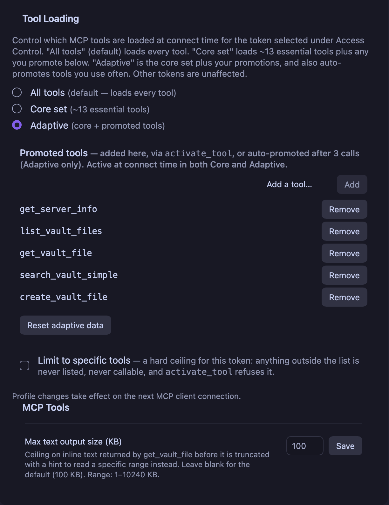
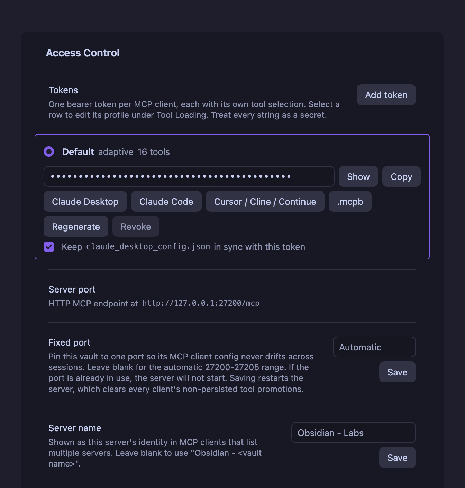
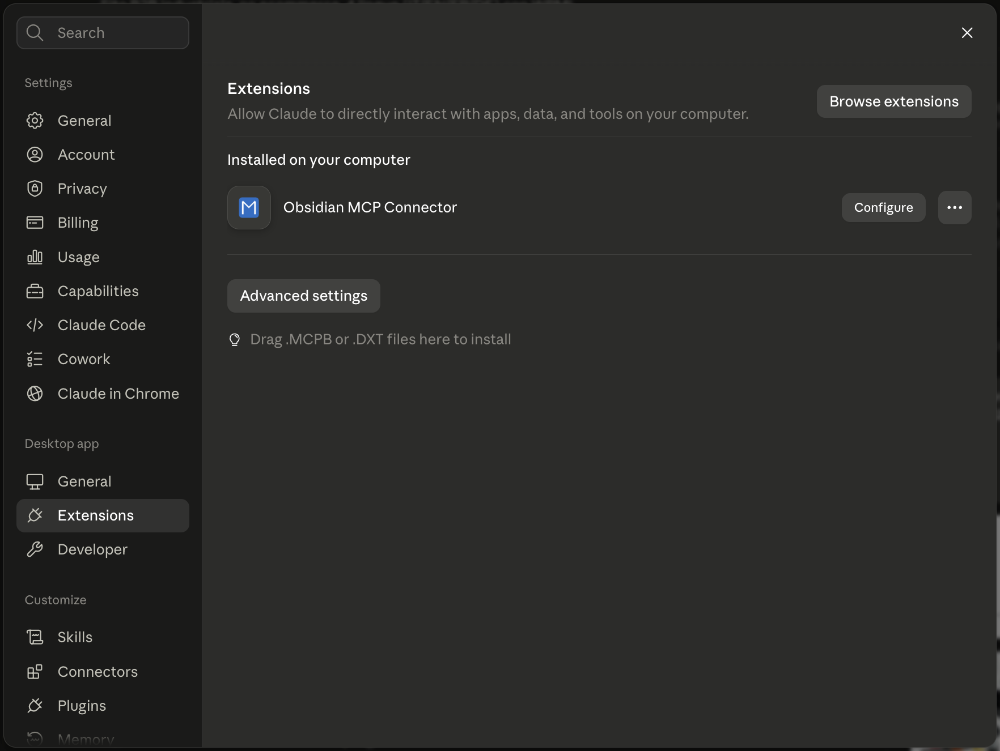

# MCP Connector for Obsidian

[](https://github.com/istefox/obsidian-mcp-connector/releases/latest)
[](https://github.com/istefox/obsidian-mcp-connector/actions)
[](LICENSE)
[](https://obsidian.md/plugins?id=mcp-tools-istefox)
[](https://github.com/istefox/obsidian-mcp-connector/stargazers)
[](https://github.com/istefox/obsidian-mcp-connector/forks)

Your Obsidian vault, exposed to AI clients over the [Model Context Protocol](https://modelcontextprotocol.io). The MCP server runs **inside Obsidian**, on loopback, with no binary to download and no cloud round-trip. Claude Desktop, Claude Code, Cursor, Cline, Continue, Windsurf and VS Code all connect to the same endpoint.

[What's new](#whats-new-in-20x) · [Quick start](#quick-start) · [Tools](#what-it-can-do) · [Rendered search results](#rendered-search-results-mcp-apps) · [Adaptive tool loading](#adaptive-tool-loading) · [Per-client tokens](#per-client-tokens) · [Prompts](#prompts) · [Protocol](#protocol-status) · [Clients](#connecting-a-client) · [Troubleshooting](#troubleshooting) · [Security](#security) · [For developers](#for-developers)

---

## How it works

```
Obsidian (Electron)                          your AI client
┌──────────────────────────────┐
│ MCP Connector plugin         │             Claude Code, Cursor, Cline,
│  ├─ MCP server (in-process)  │◄──HTTP──►   Continue, Windsurf, VS Code
│  ├─ 52 tools                 │  POST only
│  ├─ prompt renderer          │
│  └─ on-device embeddings     │◄──stdio─►   Claude Desktop
└──────────────────────────────┘  via .mcpb shim
   127.0.0.1:27200/mcp
```

Four things follow from that shape:

- **Nothing leaves your machine.** The server binds to loopback only. Vault reads and writes go through Obsidian's own `app.vault` and `app.metadataCache` APIs, so Obsidian's permission model still applies.
- **No binary ships from this repo.** The server is plugin code running in Obsidian's renderer, which removes the supply-chain surface of downloading and executing a prebuilt executable.
- **Semantic search is on-device.** Transformers.js runs the embedding model locally. No API key, no Smart Connections requirement.
- **Every request carries its own credentials.** The transport keeps no session state, which is what makes per-client tool surfaces possible.

## What's new in 2.0.x

2.0 is the release where this connector stopped waiting for the next MCP revision and started
serving it. The protocol work is the substance, and the visible half is that search results now
arrive as a list you can read instead of a wall of JSON.

| Change | Why it matters |
|---|---|
| **MCP revision `2026-07-28` is served, alongside the old one** (2.0.0) | Two protocol eras on one endpoint, one port, one token, classified per request. A client that speaks the new revision finds it by probing `server/discover`; a client that does not never sees it. Nothing you have configured needs to change. See [Protocol status](#protocol-status). |
| **Search results render as a ranked list** (2.0.0) | `search_vault_smart` and `search_vault_simple` publish an [MCP Apps](#rendered-search-results-mcp-apps) view: one row per hit with the path, the excerpt, and for the semantic search a similarity score and the heading. The text result is byte-identical to before, so clients without the extension see exactly what they saw. |
| **Prompt-list changes are announced for real** (2.0.0) | On the new revision, adding, deleting or renaming a note under `Prompts/` tells listening clients to re-read the list. On the old revision the connector now says it cannot, which is the truthful answer. This retraction is what makes the number 2.0. |
| **Per-token request counters** (2.0.0) | The transport settings show how many requests each token served and on which revision, so a client that stopped working is a row whose count stopped moving. |
| **A tool promoted by one client is announced to the others** (2.0.0) | Promotion counters are vault-wide, so one client crossing the threshold widens every adaptive client's list. On the new revision the others are now told instead of serving a stale list. [#419](https://github.com/istefox/obsidian-mcp-connector/issues/419) |
| **Windows bridge: no more mangled accents** (2.0.1) | `scripts/obsidian_mcp_bridge.py` forces its stdio streams to UTF-8, so `æ ø å ü` and non-Latin scripts survive in both directions. Root-caused, with the fix, by [@smollern](https://github.com/istefox/obsidian-mcp-connector/discussions/406). |
| **Boolean arguments accept real booleans** (2.0.0) | Six fields across five tools rejected a genuine JSON `true`, including `delete_vault_directory.recursive`. [#444](https://github.com/istefox/obsidian-mcp-connector/issues/444) |
| **`search_vault_smart` works under `auto` again** (2.0.0) | With Smart Connections installed it returned an empty result for every query, silently. [#430](https://github.com/istefox/obsidian-mcp-connector/issues/430) |

<details>
<summary>What 1.0.x brought (still current)</summary>

| Change | Why it matters |
|---|---|
| **Per-client bearer tokens** (1.0.0) | The vault holds up to 10 tokens, one per client. Claude Code can keep all 52 tools while claude.ai sees only the 13-tool Core set, from one vault and one server. |
| **Per-token tool policy** (1.0.0) | Profile, promoted tools and an optional hard allowlist all live on the token, not on the vault. |
| **Rotation no longer restarts the transport** (1.0.0) | Adding, renaming, regenerating or revoking a token takes effect on the next request. The port cannot drift and in-flight requests finish. |
| **`.mcpb` bundles are per token** (1.0.0) | Each bundle carries a token id and resolves that token's secret from the vault at connect time. Revoking the token fails the bundle closed instead of silently granting another client's access. |
| **Note embeds in prompts** (1.0.0) | `![[note]]` in a prompt body is inlined before the prompt reaches the model, so no tool call per note. |
| **Built-in-Node fix** (1.0.1) | The Claude Desktop extension now works with **Use Built-in Node.js for MCP** left on. See [#412](https://github.com/istefox/obsidian-mcp-connector/issues/412). |
| **Whole-request deadline in the shim** (1.0.1) | A failing request answers inside 45 s with the reason instead of being cancelled at 60 s with nothing logged. |
| **MCP SDK v2, error codes out of the reserved range** (0.28.2, 1.0.1) | See [Protocol status](#protocol-status). |

</details>

Full history: [`CHANGELOG.md`](CHANGELOG.md).

## Quick start

1. **Install the plugin.** Community store: Settings → Community plugins → Browse → *MCP Connector*. Or via [BRAT](https://github.com/TfTHacker/obsidian42-brat) with `istefox/obsidian-mcp-connector`.
2. **Open Settings → MCP Connector → Access control.** A fresh vault already has one token, labelled *Default*.
3. **Wire your client from that token's row.** Either **.mcpb** (Claude Desktop, drag and drop) or **Copy config** (everything else). Details in [Connecting a client](#connecting-a-client).

Ask the agent to call `get_server_info` to confirm the round trip. Requirements: Obsidian 1.7.2+, and Node.js only for the legacy `mcp-remote` path.

## What it can do

**52 tools**: 49 vault tools plus 3 always-on meta-tools. All active by default.

| Family | Tools | Notes |
|---|---|---|
| **Files** | `get_vault_file`, `get_vault_files`, `get_vault_file_partial`, `create_vault_file`, `create_vault_binary_file`, `append_to_vault_file`, `patch_vault_file`, `delete_vault_file`, `rename_vault_file`, `list_vault_files`, `create_vault_directory`, `delete_vault_directory` | `get_vault_files` reads up to 20 files per call. Text output is capped (default 100 KB) and truncation points at `get_vault_file_partial`. Renames go through `fileManager.renameFile`, so links survive. |
| **Active file** | `get_active_file`, `update_active_file`, `append_to_active_file`, `patch_active_file`, `delete_active_file`, `show_file_in_obsidian` | What the user is looking at right now. |
| **Search** | `search_vault_smart`, `search_vault_simple`, `search_vault`, `execute_dataview_query` | Semantic, plain-text with context windows, DQL or JsonLogic. Hits carry a 0-indexed `line`. |
| **Structure** | `get_vault_overview`, `get_note_outline`, `list_tags`, `get_files_by_tag`, `get_recent_files`, `get_outgoing_links`, `get_backlinks`, `list_bookmarks` | `get_vault_overview` replaces the 3 to 5 calls a session spends getting oriented. |
| **Frontmatter** | `get_note_property`, `set_note_property`, `delete_note_property`, `list_property_values` | Atomic, through `processFrontMatter`. |
| **Maintenance** | `find_broken_links`, `find_orphaned_notes`, `search_and_replace`, `rename_heading` | `search_and_replace` defaults to `dry_run`. `rename_heading` rewrites every reference pointing at it. |
| **Periodic notes** | `get_or_create_daily_note`, `get_or_create_periodic_note`, `append_to_periodic_note` | Daily through yearly. Works with core Daily Notes and with Periodic Notes. |
| **Canvas** | `get_canvas`, `add_canvas_node`, `connect_canvas_nodes` | Writes preserve every existing field, so canvases round-trip with clean diffs. |
| **Execution** | `execute_template`, `list_obsidian_commands`, `execute_obsidian_command` | Templater templates as tool calls. Commands are opt-in, see [Command execution](#command-execution). |
| **Other** | `fetch`, `get_server_info` | `fetch` returns Markdown via Turndown, paginated. |
| **Meta** | `tool_catalog`, `activate_tool`, `activate_tools` | Always reachable, see below. |

Every tool declares MCP annotations, such as `readOnlyHint`, `destructiveHint`, `idempotentHint` and `openWorldHint`, so a client can skip confirmation on reads and gate it on writes. List and scan tools take a `limit` (default 200, clamped to 1000) and report `truncated` with the real `total`.

**On `outputSchema`, deliberately absent.** Almost no tool here declares one, and that is a decision rather than an omission. Once a tool declares an output schema, SDK clients reject every response from it that lacks `structuredContent`. Several of these tools return genuinely different shapes depending on what they find, so declaring a schema for them broke `get_vault_file` for five releases (0.27.2 through 0.27.6) before the rule was written down. A tool whose result shape is polymorphic gets no schema.

**Semantic search providers.** Native MiniLM-L6-v2 (~25 MB, default), Gemma 300M (768d, best for non-Latin vaults), Multilingual-E5-Base (768d), or Smart Connections if you already use it. Providers swap live while the previous one keeps serving. The index is sharded into 16 segments by path, so editing one note rewrites one segment. While a build is running, `search_vault_smart` returns a structured `index_building` error with `filesIndexed`, `filesTotal` and an estimated `retryAfterSeconds`.

## Rendered search results (MCP Apps)

Both search tools publish a small HTML view alongside their text result, using the
[MCP Apps](https://modelcontextprotocol.io) `ui://` resource extension. In a client that supports
it, a search comes back as a ranked list you can read: one row per hit, carrying the note's path,
the matching excerpt, and, for the semantic search, a similarity score and the heading the passage
sits under. A zero-match query renders an explicit empty state naming the vault it searched.

Four things about how this is built, because they are the parts that usually go wrong:

- **The text result did not change, byte for byte.** A client that knows nothing about MCP Apps sees
  exactly what it saw before, with no stray output and nothing to configure. The row data rides in
  the result's own `_meta`, on the success branch only; when a tool errors, that key is absent and
  the view falls back to the text.
- **The `resources` capability serves the view and nothing else.** No vault content is reachable
  through `resources/*`. Listing notes there would need a permission model designed from scratch,
  since the per-token allowlist and the kill switch are tool-level concepts, so it is deliberately
  out of scope. Decisions in
  [ADR-0018](docs/architecture/ADR-0018-omc-016-mcp-apps-ui-resource.md).
- **Clicking a row asks the client to open the note in Obsidian, and the client decides.** Claude
  Desktop currently declines to follow an `obsidian://` link out of a tool result. When that
  happens the row reveals the note's vault-relative path instead, so the information is never lost.
  This is host policy and not something this plugin can change from its side.
- **The line number is shown, never used as a jump target.** `obsidian://open` has no line
  parameter, and under Smart Connections the semantic provider resolves no line at all.

## Adaptive tool loading

Every advertised tool costs context tokens on every session: the client downloads each tool's full JSON schema before the model says a word. All 52 active is roughly 10K tokens per session. Adaptive loading cuts that without putting any tool out of reach.

### Profiles

Set per token in **Settings → MCP Connector → Tool Loading**.

| Profile | Advertised | Use when |
|---|---|---|
| **All** (default) | 49 vault tools + 3 meta-tools | You want maximum capability and do not care about the schema cost. |
| **Core** | 13 core tools + 3 meta-tools + whatever you promoted | You want the smallest, most predictable surface. |
| **Adaptive** | The same, and it promotes tools you use often on its own | You want the surface to converge on how you actually work. |

Core is: `get_server_info`, `get_active_file`, `update_active_file`, `append_to_active_file`, `get_vault_file`, `list_vault_files`, `create_vault_file`, `search_vault`, `search_vault_simple`, `list_tags`, `get_note_property`, `set_note_property`, `get_or_create_daily_note`.

Promotions are honoured in **both** Core and Adaptive, so a tool you pinned stays pinned whatever the profile. Automatic promotion by call frequency is the one thing Core does not do.



*Tool Loading, per token. The promoted list is editable by hand, `activate_tool` writes into it, and frequency promotion fills it in over time. **Reset adaptive data** clears counters and promotions without touching the profile.*

### The three meta-tools

- **`tool_catalog`** (read-only, always active): the full inventory with each tool's status (`active`, `inactive`, `promoted`), call count and description. The model always knows what exists, whatever the profile.
- **`activate_tool`**: promotes one inactive tool by name, usable immediately, no reconnect. `persist: true` writes it to that token's promoted list. Obsidian shows a notice each time, so a surface never widens silently.
- **`activate_tools`**: promotes several at once and refreshes the client's tool list only once.

In Adaptive mode the plugin counts calls per tool. At **3 calls** a non-core tool is promoted and stays. Counters are vault-wide by design, because how often a tool is used describes the vault, not the client that happened to call it. The Tool Loading panel lists promoted tools, removes any of them, and resets counters without touching your profile.

### Two independent off switches

A tool can be dark for two unrelated reasons, and the difference is deliberate:

- **`userDisabled`** — you switched it off under **Tools available**. It is invisible to every token and no client can discover it or talk its way past it.
- **adaptive-inactive** — the profile has not promoted it yet. Calling it returns a recoverable error naming the activation path, never "Unknown tool", so the model can fix its own problem in one step.

### Does this violate the `tools/list` stability rule?

MCP revision `2026-07-28` says the advertised set must not vary per-connection or as a side effect of other requests on the connection, while it may vary by the authorization presented. Adaptive loading satisfies it, and the reasoning is written down in [ADR-0015](docs/architecture/ADR-0015-tools-list-invariant-and-adaptive-loading.md): registry state is process-global and token-scoped, never connection-scoped, so two clients presenting the same token get the same list, and a promotion is a vault state change (like a settings edit), not a property of one connection. `notifications/tools/list_changed` is what the clause points at for exactly this case.

## Per-client tokens

The vault holds a **list** of tokens, not one. The token on the request identifies the client, which is the only client identity a stateless transport carries. Each row in **Access control** shows the label, the profile in force, how many tools that token reaches, and per-row controls: show and copy the secret, copy a client config, export a `.mcpb`, regenerate, revoke. Up to 10 per vault.

There is deliberately **no vault-wide export**. A credential always leaves the plugin naming the client it belongs to.



*One row per client. The label, profile and tool count are on the row; the four buttons under the secret each produce a config for one client family, all authenticating as this token. Below the list: the live endpoint, **Fixed port** (blank means the automatic 27200-27205 range, and saving a fixed port restarts the server, which clears non-persisted promotions), and **Server name**, which is how this vault identifies itself in a client that lists several servers.*

| Action | Effect |
|---|---|
| **Add token** | New row, own profile, own promoted list, own allowlist. Labels are cosmetic and may repeat. |
| **Regenerate** | Replaces the secret, keeps id, label and policy. Configured clients get 401 until updated. Installed `.mcpb` bundles resolve by id and pick it up on their own. |
| **Revoke** | Deletes the token. That client's configs, bundles and bridge configs stop working; every other token is untouched. |

> **Both actions are unrecoverable.** The string is stored nowhere else and nothing in the plugin can print it again.

**Limit to specific tools** (off by default) turns a token's checklist into a hard ceiling: a tool outside it is never advertised, cannot be called, and activation refuses it by name instead of dead-ending. An empty list is legal and means the three meta-tools only. The profile itself is deliberately *not* a ceiling, since Core exists so `activate_tool` can widen it.

Upgrading from 0.28.x needs nothing: your existing token becomes row one, labelled *Default*, byte-for-byte the same string, carrying your current profile and promoted list.

## Prompts

Author MCP prompts as plain markdown in a `Prompts/` folder at the vault root. No extra plugin needed; the renderer runs in-process. Clients surface them as slash commands or attachments.

```markdown
---
tags:
  - mcp-tools-prompt
description: Summarize my recent daily notes on a given topic
---

Summarize my notes from the past **<% tp.mcpTools.prompt("days", "How many days back") %>** days
about **<% tp.mcpTools.prompt("topic", "The subject") %>**.

Here is the brief they should be read against:

![[Projects/Q3 brief]]

Give me the three recurring themes and one action item.
```

- The `tp.mcpTools.prompt(...)` line **declares** a parameter and is stripped from the output. Inject the value with `{{days}}`, `{{topic}}`, as many times as you like.
- An inline `#mcp-tools-prompt` hashtag works instead of frontmatter. Both spellings of the frontmatter tag are accepted.
- **Embeds** are inlined after parameters are filled, so `![[{{note}}]]` lets the client pick the note. `![[note|alias]]`, `![[note#Heading]]` and `![[note#^blockid]]` all work. Depth 1, at most 32 KB across at most 20 embeds per render. An embed that cannot resolve keeps its token and gains a comment saying why, so nothing disappears quietly.
- Other Templater expressions pass through verbatim; the server does not evaluate them.

Full contract: [`docs/features/prompt-system.md`](docs/features/prompt-system.md).

## Command execution

Off by default. When enabled, the agent can run Obsidian commands from the command palette, and only those you authorize.

- `list_obsidian_commands` is read-only discovery and always safe.
- `execute_obsidian_command` is gated. On the allowlist it runs. Off the allowlist, Obsidian shows a modal with **Deny / Allow once / Allow always** and the HTTP call waits up to 30 s for your answer. Master toggle off means every call is denied with no modal.
- **Deny by default, no wildcards, no auto-population, per vault.**
- A command whose id or name looks destructive (`delete`, `purge`, `reset`, `wipe`, and similar) gets a red warning and **Allow always is disabled**. A nudge, not a gate.
- Hard limit 100 calls/minute server-side, plus a configurable soft warning at 30/minute.
- The last 50 decisions are kept in a ring buffer under **Recent invocations**, exportable as RFC 4180 CSV (`timestamp,commandId,decision,reason`).

## Protocol status

**The connector serves two MCP revisions from one endpoint.** `2026-07-28`, the revision that moves
MCP to a stateless request/response core, and the `2025-11-25`-and-earlier line that every shipping
client still negotiates. Same port, same URL, same bearer token. Each request is classified on its
own, from one read of its body, so adopting the new revision took nothing away from the old one and
no configured client, generated bundle or bridge config needed touching. Decisions in
[ADR-0016](docs/architecture/ADR-0016-omc-008-adopt-mcp-spec-2026-07-28.md).

One thing to know if you are implementing against this: **the new revision is not reachable through
`initialize`.** A client finds it by probing `server/discover`, and falls back to the handshake on
its own if that method is absent. The SDK's `LATEST_PROTOCOL_VERSION` is the handshake offer and by
construction can never name the 2026 revision, so it tells you nothing about whether a server serves
it.

| `2026-07-28` direction | Status here |
|---|---|
| Stateless core, no protocol-level sessions, no `Mcp-Session-Id` | Never had them. Every request carries its own credentials, which is what makes per-token tool surfaces possible in the first place. |
| `GET`/`DELETE` on the MCP endpoint answer `405` | By design. There is no server-initiated stream on the legacy era at all. |
| `subscriptions/listen` replaces the GET stream | Served. A client that opens one is acknowledged, gets a subscription id, and receives the notification types it opted into. |
| `notifications/tools/list_changed` | Delivered two ways: on the caller's own POST response, and fanned out to every open listen stream that asked for it, so a promotion triggered by one client reaches the others. |
| `notifications/prompts/list_changed` | Honoured on the new revision, declared unavailable on the old one, where a POST-only transport structurally cannot deliver it. See [ADR-0017](docs/architecture/ADR-0017-omc-023-prompts-list-changed-by-era.md). |
| `resources/*` capability | Declared, and it serves `ui://` application resources only. No vault content is reachable through it, deliberately: the per-token allowlist and the kill switch are tool-level concepts and none of them reaches a resource surface. |
| Removed methods answer `404` / `-32601` on the new era | Confirmed by the conformance suite for `initialize`, `ping`, `logging/setLevel`, `resources/subscribe` and `resources/unsubscribe`. A claim-less client carries no envelope, classifies legacy, and keeps being served. |
| `-32000`–`-32019` is a legacy range new code should avoid | The `.mcpb` shim and the Windows bridge report local failures as `-33000`, below the reserved range entirely. |
| Per-request authorization may scope the tool set | Exactly what [per-client tokens](#per-client-tokens) do. |
| Tool-set stability clause | Analysed and satisfied, see [ADR-0015](docs/architecture/ADR-0015-tools-list-invariant-and-adaptive-loading.md). |

**Measured, not asserted.** The `server-stateless` suite from the official conformance harness runs
against a headless build of this connector and reports **26 of 28**. It went from 7 of 27 over the
course of this work. The two that stay red need a fixture tool shipped in every user's vault purely
so a test can mutate the tool list, and this project will not ship one; they are named in a
four-entry baseline that is maintained by hand and never regenerated from a failing run, so a check
that starts failing gets investigated rather than absorbed. The job runs nightly rather than per PR,
because it clones and builds the suite from source at a pinned ref.

**What is still open.** Retiring the legacy era is a decision with a measured trigger rather than a
plan: the legacy request counter has to sit at zero for two minor releases or 60 days. It is nowhere
near. Until then both eras are served, and the counters in the transport settings are how you watch
that number.

## Connecting a client

Every client is wired from its own row in **Access control**. Whichever button you use, the snippet or bundle authenticates as that row's token and no other.

### Claude Desktop

Claude Desktop speaks stdio, so it needs a bridge. The `.mcpb` extension is the supported path and needs no Node install of your own.

1. Click **.mcpb** on the token's row.
2. Drag the file onto Claude Desktop.
3. It installs with no prompts and appears under Settings → Extensions.



*Installed. Claude Desktop's own Extensions pane takes the `.mcpb` by drag and drop, with no config file to edit and no Node install of your own.*

The bundle resolves that token's secret and the live port from the vault at connect time, so regenerating the secret or changing the port needs no re-export. Revoking the token fails it closed with an error asking for a fresh export, which is the point. A bundle exported before 1.0.0 predates the token id and follows whichever token is currently first, so re-export once after upgrading.

**The releases page carries no `.mcpb`, and that is deliberate.** Every bundle has your vault's path, your config folder's name and one token's id written inside it, which is what lets it connect with nothing to fill in and fail closed when you revoke that token. A build made on a CI runner knows none of those, so the only place a correct bundle can come from is the button above. Releases up to and including 2.0.1 do have one attached; it takes a different route, asks you to paste a token and a port by hand, and depends on `npx` and a network fetch. Use the export instead.

<details>
<summary>Alternative: manual <code>mcp-remote</code> config</summary>

Needs Node.js on the PATH that Obsidian inherits. The plugin detects it and offers a one-click Homebrew install on macOS.

```json
{
  "mcpServers": {
    "obsidian-mcp-connector": {
      "command": "npx",
      "args": ["-y", "mcp-remote", "http://127.0.0.1:27200/mcp",
               "--header", "Authorization: Bearer YOUR_TOKEN"]
    }
  }
}
```

Paste into `claude_desktop_config.json` (Settings → Developer → Edit Config) and restart the app fully, Cmd+Q on macOS. Or tick **Keep `claude_desktop_config.json` in sync with this token** on the row: at most one token owns the file, a `.backup` is written before each rewrite, and revoking the owner removes the entry rather than pointing it at someone else.
</details>

<details>
<summary>Windows: use the POST-only bridge</summary>

`mcp-remote` hangs for 60 s on connect on Windows ([geelen/mcp-remote#296](https://github.com/geelen/mcp-remote/issues/296)), against unrelated MCP servers too. Use the bundled `scripts/obsidian_mcp_bridge.py`, standard library only:

**Update the bridge if you are on a copy older than 2.0.1.** Before that release it read and wrote its stdio streams using whatever encoding your Windows locale preferred, usually not UTF-8, so any file name, folder name or note content containing a character outside plain ASCII was corrupted in both directions: a note at `Personer/Person - Søren Møller-Nielsen.md` was looked up as `Personer/Person - Søren Møller-Nielsen.md` and reported missing. The bridge now forces both streams to UTF-8 before reading anything. If you set `PYTHONUTF8=1` or `PYTHONIOENCODING=utf-8` in your client config to work around it, you can keep or drop it; the bridge no longer depends on either.

```json
{
  "mcpServers": {
    "obsidian": {
      "command": "python",
      "args": ["C:\\Users\\you\\obsidian_mcp_bridge.py", "http://127.0.0.1:27200/mcp"],
      "env": { "OBSIDIAN_BEARER_TOKEN": "paste-your-token-here" }
    }
  }
}
```

Full setup: [`docs/windows-post-only-bridge.md`](docs/windows-post-only-bridge.md).
</details>

### Claude Code

Native HTTP transport. **Copy config for Claude Code**, then paste into `~/.claude.json` (project) or `~/.claude/settings.json` (global), or use `claude mcp add` with the same fields.

```json
{
  "mcpServers": {
    "obsidian-mcp-connector": {
      "type": "http",
      "url": "http://127.0.0.1:27200/mcp",
      "headers": { "Authorization": "Bearer YOUR_TOKEN" }
    }
  }
}
```

### Cursor, Cline, Continue, Windsurf, VS Code

**Copy config for streamable-http clients** produces the generic payload these accept. Check each client's docs for the file location and wrapping keys.

### Verifying

Your client should list the tools your token's profile allows, plus any prompts tagged `#mcp-tools-prompt`. For request-level inspection without a model in the loop:

```bash
npx -y @modelcontextprotocol/inspector
# point it at http://127.0.0.1:27200/mcp with your bearer token
```

## Troubleshooting

| Symptom | Cause and fix |
|---|---|
| `401` on every call | The token matches no row, usually after a regenerate or revoke. Copy the current string from that row, or add a new token if the row is gone. |
| `ECONNREFUSED 127.0.0.1:<port>` | Claude Desktop reads its config only at launch. Quit fully (Cmd+Q) and reopen. Check the port matches the one the plugin logs, and that only one vault has the plugin enabled. |
| Claude Desktop: `Failed to connect`, `command not found` | Only affects the `mcp-remote` path. Settings → **Claude Desktop integration** reports whether `node` and `npx` are on the PATH Obsidian inherits, and installs Node for you on macOS. |
| 60 s hang on Windows, then "Could not attach" | `mcp-remote` bug. Switch to the [POST-only bridge](#claude-desktop). |
| 60 s hang on macOS with **Use Built-in Node.js for MCP** on | Fixed in **v1.0.1**. Update, re-export the `.mcpb`, reinstall once; the setting can stay on. On 1.0.0 and earlier, turn the setting off and restart fully. ([#412](https://github.com/istefox/obsidian-mcp-connector/issues/412)) |
| `.mcpb` disconnected most of the time | Fixed in v0.26.0, which stopped baking the port and token into the manifest. Update and re-export once. |
| First `search_vault_smart` is slow | Expected: ~25 MB model download, cached afterwards. A `content-length` warning in DevTools is harmless. |

On the built-in-Node path Claude Desktop does not write the connector's own stderr to `mcp-server-Obsidian MCP Connector.log`, so the startup banner and per-request lines are missing there even when everything works. To collect them, run the extension's `server/index.js` directly, or turn the setting off for the test. General logs: Settings → **Open Logs**, or Obsidian's console (`Cmd+Opt+I` / `Ctrl+Shift+I`).

## Security

- **Loopback only.** The bind address is hardcoded to `127.0.0.1`, on the first free port in 27200-27205 unless you pin one. Bearer auth is required on every request, and a miss is a bare 401 that reveals nothing about which tokens exist.
- **No binary.** Nothing prebuilt is downloaded or executed.
- **Tokens are local.** Generated per install, stored in the vault's `data.json`, revealed only on demand in settings, up to 10 per vault.
- **Vault access is Obsidian's.** Every read and write goes through `app.vault`, under Obsidian's own permission model. Concurrent writes go through `Vault.process()` plus a process-wide write mutex, so two MCP writes to one file cannot lose an update.
- **Command execution is opt-in** and per vault.

Report vulnerabilities through [SECURITY.md](SECURITY.md), never in a public issue.

## For developers

Bun monorepo, feature-based. Full contract in [`docs/project-architecture.md`](docs/project-architecture.md).

```
packages/
├── obsidian-plugin/   # plugin: MCP server, tools, transport, settings UI (Svelte)
│   ├── src/features/  # each feature owns services/, components/, colocated *.test.ts
│   └── scripts/       # connectorShim.js (the .mcpb shim), generators, bench
├── shared/            # ArkType schemas and types shared with the shim
└── test-site/         # SvelteKit harness, dev only, never shipped
```

```bash
bun install
bun run check         # tsc --noEmit across packages (does NOT type-check .svelte)
bun test              # 1700+ unit tests, colocated
bun run format:check  # CI enforces this; the other gates pass without it
bun run build         # production bundle
bun run release       # build + zip (no .mcpb — that is a per-token export from the plugin)
```

Full gate before calling anything done: `bun run check && bun test && bun run format:check`.

### Design invariants

These are the ones worth knowing before you change anything:

- **The transport is stateless and POST-only.** `GET /mcp` returns 405 on purpose. No server-initiated stream exists, so `initialize` state is never available to a later request.
- **`notifications/tools/list_changed` rides the caller's own POST response** with that call's `relatedRequestId`. Activation calls switch their response to SSE for it. There is no fan-out and no broadcast path.
- **The registry is global truth; the token supplies a resolved `ToolScope`.** Credentials live in the `mcpTransport` slice, policy in `toolLoading.profiles[tokenId]`, joined by id. The registry never dereferences a token id. A missing policy entry resolves to today's behaviour rather than locking a client out.
- **Precedence:** `userDisabled` > per-token allowlist > profile + promoted > always-active meta-tools.
- **Settings are sliced,** and every write goes through `SettingsStore.updateSlice` under a process-wide mutex. `data.json` is shared by every feature, so an unserialized read-modify-write clobbers a neighbour. Returning the input unchanged means NO_CHANGE and skips the write.
- **A polymorphic tool must not declare an `outputSchema`.** SDK clients reject every response lacking `structuredContent` once one is declared. This cost `get_vault_file` five releases.
- **The `.mcpb` shim is a separate process against an already-distributed bundle.** Its `data.json` read contract stays backward-compatible, and it fails closed on an unknown token id. Falling back to a default credential would turn a revocation into a grant.

### Adding a tool

1. Write `src/features/mcp-tools/tools/myTool.ts` exporting a schema and a handler, plus `myTool.test.ts` beside it.
2. Register it in `src/features/mcp-tools/index.ts` with `registry.register(myToolSchema, handler)`.
3. Declare annotations in `toolAnnotations.ts`. Read-only tools that lie about it cost users a confirmation prompt they should not see.
4. Decide whether it belongs in `CORE_SET` (`src/features/adaptive-tool-loading/constants.ts`). Most tools do not.

### Working on the shim

`packages/obsidian-plugin/scripts/connectorShim.js` is the real source. `src/features/mcp-client-config/assets/connectorShimSource.ts` is **generated** from it:

```bash
bun packages/obsidian-plugin/scripts/gen-shim-source.ts
```

Editing the shim without regenerating ships the old one, silently. The shim is zero-dependency CommonJS and must start under both loaders: `node server/index.js` and the host `import()` that Claude Desktop uses with built-in Node. That is [ADR-0013](docs/architecture/ADR-0013-mcpb-pure-node-shim.md), and getting it wrong was [#412](https://github.com/istefox/obsidian-mcp-connector/issues/412).

### Where decisions live

[`docs/architecture/`](docs/architecture/) holds the ADRs and is authoritative. The load-bearing ones: [0013](docs/architecture/ADR-0013-mcpb-pure-node-shim.md) the pure-Node `.mcpb` shim, [0014](docs/architecture/ADR-0014-per-client-tool-profiles.md) per-client tool profiles, [0015](docs/architecture/ADR-0015-tools-list-invariant-and-adaptive-loading.md) the `tools/list` invariant, [0010](docs/architecture/ADR-0010-split-registry-disable-states.md) split registry disable states, [0009](docs/architecture/ADR-0009-structured-tool-output.md) structured output. Per-issue specs are in [`docs/specs/`](docs/specs/).

Svelte components sit outside `tsc --noEmit`, so UI changes need a real vault to verify. Community-plugin review lints `src/**` only and forbids `eslint-disable` on `obsidianmd/*` rules, which is why non-plugin code lives outside `src/`.

### Contributing

Read [CONTRIBUTING.md](CONTRIBUTING.md) first. Fork, branch from `main`, keep PRs scoped, run the full gate, open the PR. Conventional Commits.

## Support

[Open an issue](https://github.com/istefox/obsidian-mcp-connector/issues) for bugs and feature requests. Changelog: [`CHANGELOG.md`](CHANGELOG.md) and [Releases](https://github.com/istefox/obsidian-mcp-connector/releases).

**Also by istefox:** [istefox-dt-mcp](https://github.com/istefox/istefox-dt-mcp), an MCP server for [DEVONthink 4](https://www.devontechnologies.com/apps/devonthink) on macOS. Preview-then-apply with audit log and selective undo, optional local RAG, `.mcpb` bundle. Local-only, MIT.

## License

[MIT](LICENSE). For background on the protocol itself, see the [MCP introduction](https://modelcontextprotocol.io/introduction).
